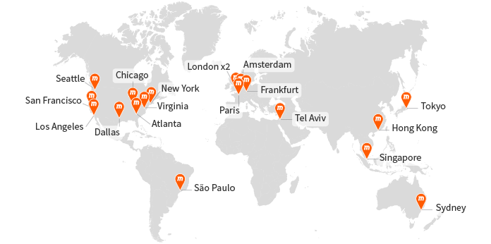

# HighLoad

## Тема работы

Spotify

## Основной функционал

- хранение и воспроизведение аудио файлов
- рекомендательная система по подбору музыкальных произведений, обучающаяся на основе пропуска треков
- хранение информации о музыкальных произведениях (текст, исполнители, альбомы)
- хранение общих плейлистов
- возможность составлять собстевнные плейлисты пользователями

## Целевая аудитория

Во втором квартале 2022 года сервис потоковой передачи музыки Spotify сообщил о 433 миллионах активных пользователей по всему миру. Это ознаменовало увеличение более чем на 60 миллионов всего за один год[1]:

Во втором квартале 2022 года количество ежемесячно активных пользователей Spotify по всему миру, поддерживаемых рекламой, достигло 256 миллионов по сравнению с 210 миллионами годом ранее.[2] 

По состоянию на второй квартал 2022 года у Spotify было 188 миллионов платных подписчиков по всему миру по сравнению со 165 миллионами в соответствующем квартале 2021 года.[3]

Ежедневно 44% пользователей слушают Spotify[4]

В целом Spotify наиболее популярен среди молодежи. Более половины пользователей Spotify моложе 35 лет[5]:

- 29% пользователей Spotify — миллениалы, а 26% из них моложе 24 лет. 
- Spotify также популярен среди пожилых людей: 19% пользователей старше 55 лет.
- Что касается пола, 56% пользователей Spotify — мужчины, а 44% — женщины.

Ежегодное количество пользователей Spotify по регионам с 2016 по 2021 год[6]:

| Год  | Европа   | Северная Америка | Латинская Америка | Остальной мир |
|------|----------|------------------|-------------------|---------------|
| 2016 | 40 млн.  | 36 млн.          | 20 млн.           | 8 млн.        |
| 2017 | 51 млн.  | 46 млн.          | 28 млн.           | 13 млн.       |
| 2018 | 67 млн.  | 56 млн.          | 38 млн.           | 20 млн.       |
| 2019 | 84 млн.  | 65 млн.          | 49 млн.           | 35 млн.       |
| 2020 | 102 млн. | 78 млн.          | 66 млн.           | 54 млн.       |
| 2021 | 121 млн. | 85 млн.          | 78 млн.           | 71 млн.       |

## Расчет нагрузки

* Месячная аудитория: 433 млн.
* Дневная аудитория: 44% от месячной аудитории - 190 млн.

### Хранение данных

Битрейт песни зависит от подписки и от качества соединения[7].
Для бесплатной версии высокое качество - 160 кбит/с, нормальное - 96 кбит/с, низкое - 24 кбит/с
Для платной версии высокое качество - 320 кбит/с, нормальное - 96 кбит/с, низкое - 24 кбит/с

Длительность одной композиции составляет в среднем 197 секунд[8].

Количество песен в Spotify - 80 млн.[9]

В расчетах не будем учитывать хранение информацию об альбомах и плйлистах

Размер 1 песни для каждого битрейта:
- 197 * 24 = 591 Кбайт = 0,58 Мбайт 
- 197 * 96 = 2,3 Мбайт 
- 197 * 160 = 3,8 Мбайт 
- 197 * 320 = 7,7 Мбайт

Размер хранилища для аудиофайлов:
80 * 10^6 * (0,58 + 2,3 + 3,8 + 7,7) = 1097 ТБ

Пусть средний размер текста песни - 3000 символов(UTF-8) = 3000 байт
Тогда размер хранилища для текстов песен: 3000 * 80 * 10^6 / 1024 / 1024 / 1024 = 224 Гбайт

Пусть фото обложки песен хранится в двух форматах:
- 180 х 180, webp = 15 Кбайт
- 3000 х 3000, webp = 600 Кбайт
Тогда размер хранилища для обложек песен: (15 + 600) * 80 * 10^6 / 1024 / 1024 / 1024 = 46 Тбайт

### Сетевой трафик

Согласно последним доступным данным, среднее количество времени, которое активные пользователи платформы тратят на прослушивание Spotify, составляет 25 часов в месяц.[10]

То есть примерно 50 минут в день

188 млн. платных подписчиков из 433 млн. пользователей - 43%

DAU 190 млн. 

Дневной трафик:

`190 * 10^6 * 50 * 60 * (0,43 * 320 + 0,57 * 160)/8/1024/1024/1024 = 15182 Тб/сутки`

Трафик в секунду:

`15182 / 24 / 3600 * 8 = 1,4 Тбит/с`

Исходя из данных 2018 года[11], пиковое время - 16:00. 
В среднем в секунду сайтом пользуются:

`190 * 10^6 * 50 * 60 / 24 / 60 / 60 = 6597222 человека`

Пусть в пиковые часы сайтом пользуются в 2 раза больше человек, чем в среднем по дню

`6597222 * 2 * (0,43 * 320 + 0,57 * 160)/8/1024/1024 = 2,8 Тбит/с`

### RPS

#### Авторизация

Пусть запрос на авторизацию совершается раз в 3 месяца

`433 * 10^6 / 3 / 30 / 24 / 60 / 60 = 56 RPS`

#### Получение информации о своем плейлисте

Пусть человек заходит в свою медиатеку 2 раза в день

`190 * 10^6 * 2 / 24 / 60 / 60 = 4398 RPS`

#### Получение информации об конкретном альбоме, плейлисте

Пусть человек прослушивает 4 плейлиста в день:

`190 * 10^6 * 4 / 24 / 60 / 60 = 8796 RPS`

#### Добавление трека в плейлист

Пусть добавляет в плейлист в среднем 3 трека в дент:

`190 * 10^6 * 3 / 24 / 60 / 60 = 6597 RPS`

#### Создание плейлиста

Пусть человек создает новый плейлист раз в 3 месяца:

`433 * 10^6 / 3 / 30 / 24 / 60 / 60 = 56 RPS`

#### Загрузка аудиофайла

Средняя продолжительность одной песни - 197 секунд

Среднее время прослушивания песен в Spotify - 50 минут

`50 * 60 / 197 = 15` треков в среднем пользователь слушает в день

`190 * 10^6 * 15 / 24 / 60 / 60 = 32986 RPS`

#### Загрузка информации о треке

Загружается трек и информация о нем - 2 запроса

Из предыдущего пункта мы знаем, что пользователь в среднем слушает 15 треков в день

`190 * 10^6  * 15 / 24 / 60 / 60 = 32986 RPS`

#### Поиск

Пусть человек пользуется поиском 3 раза в день

`190 * 10^6 * 3 / 24 / 60 / 60 = 6597 RPS`

#### Получение плейлиста рекомендаций

Пусть человек заходит в плейлист рекомендаций 2 раза в день, рекомендации создаются на основе данных о прослушанных песнях

`190 * 10^6 * 2 / 24 / 60 / 60 = 4398 RPS`

#### Итог

Всего RPS = 96870 RPS

| Авторизация | Получение своего плейлиста | Создание плейлиста | Контент альбомов/плейлистов | Поиск    | Загрузка аудиофайла | Загрузка информации о треке | Плейлист рекомендаций | Добавление трека |
|-------------|----------------------------|--------------------|-----------------------------|----------|---------------------|-----------------------------|-----------------------|------------------|
| 56 RPS      | 4398 RPS                   | 56 RPS             | 8796 RPS                    | 6597 RPS | 32986 RPS           | 32986 RPS                   | 4398 RPS              | 6597 RPS         |

## Логическая схема

## Физическая схема

Для хранения основных данных сервиса будем использовать PostgreSQL, так как это широкоиспользуемая БД, соответсвенно ее проще поддерживать, высокая надежность. 

Рассчитаем объем памяти и RPS:

#### User

| Столбец         | Тип       | Размер |
|-----------------|-----------|--------|
| id              | INT       | 4 Б    |
| name            | VARCHAR   | 32 Б   |
| email           | VARCHAR   | 64 Б   |
| hash_password   | VARCHAR   | 128 Б  |
| salt            | VARCHAR   | 64 Б   |
| premium_expired | TIMESTAMP | 4 Б    |
| image_url       | VARCHAR   | 256 Б  |

Всего 433 млн. пользователей

`Размер = 552 * 433 * 10^6 = 222,6 Гб`

Авторизация из таблицы выше

`RPS = 56 RPS`

#### Playlist

| Столбец         | Тип       | Размер |
|-----------------|-----------|--------|
| id              | INT       | 4 Б    |
| user_id         | INT       | 4 Б    |
| name            | VARCHAR   | 64 Б   |
| image_url       | VARCHAR   | 256 Б  |

Предположим, что у каждого пользователя, помимо своей медиатеки, есть еще по 2 составленыых плейлиста
Также на спотифай есть много общедоступных плейлистов, преположим, их 10 тысяч

Тогда

`Размер = 328 * (3 * 433 * 10^6 + 10000)= 396,8 Гб`

Для RPS не будем учитывать общие плейлисты, так как они создаются относительно редко, RPS из таблицы выше

Создание плейлиста, добавление трека
`INSERT RPS = 56 RPS + 6597 RPS = 6653 RPS`

Получение своего плейлиста, получение контента альбомов/плейлистов, получение плейлиста рекомендаций
`SELECT RPS = 4398 RPS + 8796 RPS + 4398 RPS = 17592 RPS`

#### Musician

| Столбец     | Тип     | Размер |
|-------------|---------|--------|
| id          | INT     | 4 Б    |
| name        | VARCHAR | 64 Б   |
| description | VARCHAR | 512 Б  |
| image_url   | VARCHAR | 256 Б  |

1,2 млн. исполнителей [12]

`Размер = 1,2 * 10^6 * 836= 956,7 Мб`

Insert редко, не будем учитывать

Select - получение контента альбомов/плейлистов, информация о треке, поиск

`SELECT RPS = 8796 RPS  + 32986 RPS + 6597 RPS = 48379 RPS`

#### Track

| Столбец       | Тип     | Размер |
|---------------|---------|--------|
| id            | INT     | 4 Б    |
| name          | VARCHAR | 64 Б   |
| duration      | INT     | 4 Б    |
| conn_320_path | VARCHAR | 256 Б  |
| conn_160_path | VARCHAR | 256 Б  |
| conn_96_path  | VARCHAR | 256 Б  |
| conn_24_path  | VARCHAR | 256 Б  |
| text          | VARCHAR | 1024 Б |
| image_url     | VARCHAR | 256 Б  |

`Размер = 80 * 10^6 * 2376= 177 Гб`

Insert редко, не будем учитывать

Select - поиск, информация об альбомах, информация о треке

`SELECT RPS = 48379 RPS`

#### Album

| Столбец     | Тип     | Размер |
|-------------|---------|--------|
| id          | INT     | 4 Б    |
| name        | VARCHAR | 64 Б   |
| id_musician | INT     | 4 Б    |
| track_count | INT     | 4 Б    |
| duration    | INT     | 4 Б    |
| image_url   | VARCHAR | 256 Б  |

Допустим у каждого исполнителя по 5 альбомов

`Размер = 5 * 1,2 * 10^6 * 336 = 1,9 Гб`

Insert редко, не будем учитывать

Select - поиск, информация об альбомах

`SELECT RPS = 4398 RPS + 8796 RPS = 15393 RPS`

#### Для таблиц реализущих связи многие-ко-многим 12 байт (ID 4 байта + 2xID 4 байта).

#### Итоговое количество данных:

В среднем у одного исполнителя 80 млн треков / 1,2 млн исполнителей = 66 треков

Пусть в альбоме в среднем 15 треков

Пусть в плейлисте в среднем 200 треков

`222,6 Гб + 396,8 Гб + 956,7 Мб + 177 Гб + 1,9 Гб + 12 байт * (1,2 * 10^6 исполнителей * 66 треков + 1,2 * 10^6 исполнителей * 5 альбомов + 15 треков * 5 альбомов * 1,2 * 10^6 исполнителей + 200 треков * 10000 поейлистов) = 799 Гб`

#### Итоговое количество RPS:

`INSERT RPS = 56 RPS + 6597 RPS = 6653 RPS`

При аутентификации в сервисе и открытии профиля происходит получение данных пользователя и списка плейлистов. Список плейлистов запрашивается 2 раза в день в среднем.
При открытии плейлиста происходит получение списка треков - 1 запрос разбитый пагинацией, предположим, по 50 треков в части. 
Пусть каждый пользователь в среднем может долистать до 100 трека - 2 запроса. Просматривает 4 плейлиста.
При добавлении трека в плейлист должен произойти поиск, получение информации об исполнителе, информации о треке. 3 добавляет в среднем.
Также 3 поиска в день. Итого 23 запроса

`SELECT RPS = 190 * 10^6 * (1 + 2 * 1 + 4 * 2 + 3 * 3 + 3) / 24 / 60 / 60 = 50578 RPS`

[//]: # (#### Track_Playlist)

[//]: # ()
[//]: # (| Столбец     | Тип       | Размер |)

[//]: # (|-------------|-----------|--------|)

[//]: # (| id          | INT       | 4 Б    |)

[//]: # (| playlist_id | INT       | 4 Б    |)

[//]: # (| track_id    | INT       | 4 Б    |)

[//]: # ()
[//]: # (Пусть в плейлисте в среднем 100 треков)

[//]: # ()
[//]: # (`Размер = &#40;3 * 433 * 10^6 + 10000&#41; * 100 * = 1,9 Гб`)

[//]: # ()
[//]: # (`INSERT RPS = 56 RPS`)

[//]: # (`SELECT RPS = 4398 RPS + 4398 RPS + 8796 RPS = 17592 RPS`)

[//]: # ()
[//]: # (#### Track_Album)

[//]: # ()
[//]: # (| Столбец  | Тип       | Размер |)

[//]: # (|----------|-----------|--------|)

[//]: # (| id       | INT       | 4 Б    |)

[//]: # (| album_id | INT       | 4 Б    |)

[//]: # (| track_id | INT       | 4 Б    |)

[//]: # ()
[//]: # (Пусть в альбоме в среднем 10 треков)

[//]: # ()
[//]: # (`Размер = 5 * 1,2 * 10^6 * 10 * 12 = 686,6 Мб`)

[//]: # ()
[//]: # (`SELECT RPS = 8796 RPS`)

[//]: # ()
[//]: # (#### Musician_Album)

[//]: # ()
[//]: # (| Столбец     | Тип       | Размер |)

[//]: # (|-------------|-----------|--------|)

[//]: # (| id          | INT       | 4 Б    |)

[//]: # (| musician_id | INT       | 4 Б    |)

[//]: # (| album_id    | INT       | 4 Б    |)

[//]: # ()
[//]: # (#### Track_Musician)

[//]: # ()
[//]: # (| Столбец     | Тип       | Размер |)

[//]: # (|-------------|-----------|--------|)

[//]: # (| id          | INT       | 4 Б    |)

[//]: # (| musician_id | INT       | 4 Б    |)

[//]: # (| track_id    | INT       | 4 Б    |)

#### Track_History

| Столбец  | Тип       | Размер |
|----------|-----------|--------|
| id       | INT       | 4 Б    |
| user_id  | INT       | 4 Б    |
| track_id | INT       | 4 Б    |
| date     | TIMESTAMP | 4 Б    |

История прослушиваний, обновляется при каждой загрузке трека. 
Рассчитаем сколько необходимо хранить данных по истории прослушивания в течение 2 месяцев. Размер в день:

`Размер = 16 байт * 15 * 190 * 10^6= 42,5 Гб`

За 2 месяца:

`Размер = 2548 Гб`

Для хранения истории за 2 месяца мы можем использовать Redis. По истечению срока хранения целесообразно перенести данные в более длительное хранилище в целях создания рекомендация и сбора статистики.
Для таких целей хорошо подойдет Clickhouse. Данная БД является колоночной, и создана специально для проведения аналитических запросов.

#### Track_Queue

| Столбец             | Тип       | Размер  |
|---------------------|-----------|---------|
| id                  | INT       | 4 Б     |
| user_id             | INT       | 4 Б     |
| track_id            | INT[N]    | N * 4 Б |
| last_listening_date | TIMESTAMP | 4 Б     |

Так как очередь воспроизведения достаточно динамически изменяющаяся единица, целесообразно вынести ее из общей логики хранения в отдельную базу с возможностью быстрого обращения.
В качестве системы хранения для этого можно использовать Redis.
Данная БД хранит данные в оперативной памяти, обладает высокой производительностью на операциях set-get, поддерживает master-slave репликацию.

Такжже необходимо улалять данные неактивных пользователей

Рассчитаем объем требуемой памяти для хранения очереди:

Так как в плейлисте в среднем 200 треков:

`Размер = 4 байта * 203 * 190 * 10^6= 143,7 Гб`

Так в среднем человек слушает 15 треков, то:

`RPS = 32986 RPS`

#### Session

| Столбец      | Тип       | Размер |
|--------------|-----------|--------|
| id           | INT       | 4 Б    |
| user_id      | INT       | 4 Б    |
| session_hash | VARCHAR   | 128 Б  |
| expired      | TIMESTAMP | 4 Б    |

Для хранения сессий пользователя также будем использовать Redis. 
Так как для каждого действия пользователя необходима проверка на авторизацию, выше было расчитано примерное число запросов пользователя - 23:

`RPS = 190 * 10^6 * (1 + 2 * 1 + 4 * 2 + 3 * 3 + 3) / 24 / 60 / 60 = 50578 RPS`

Для хранения изображений будем пользоваться Amazon S3 хранилищем.

Для хранения музыкальных треков будем использовать CDN, что позволит создать распределенную сеть обладающую надежностью и высокой доступностью данных для пользователя.

#### Индексы

| Таблица  | Поле         | Описание                                  |
|----------|--------------|-------------------------------------------|
| Session  | session_hash | Нужен для всех запросов пользователя      |
| Musician | name         | для поиска                                |
| Track    | name         | для поиска, получения информации о треках |
| Album    | name         | для поиска                                |
| Playlist | name         | для получения информации о плейлистах     |
| User     | email        | для получения профиля пользователя        |

#### Шардинг

Сведения о пользователях можно шардировать по ID пользователя, распределив нагрузку на несколько серверов. Данные также можно реплицировать для обеспечения отказоустойчивости и надежности. 

Также можно шардировать данные о треках по ID трека

## Технологии

Для Android пиложения - Kotlin
IOS - Swift

В качестве бекенда будем использовать микросервисную архитектуру на Go, взаимодействие с помощью gRPC.
В качестве балансировщика, сервера для отдачи статики и прокси сервера будем использовать Nginx

В качестве БД будем использовать Postgres, Redis, Clickhouse

Для хранения картинок Amazon S3

Для хранения аудиофайлов CDN сервера
Для выбора ближайшего CDN сервера используем Geo-based DNS технологию

18 городов

нам необходимо хранить 1097 Тб медиатеки, для этого пусть на серверах будут SSD диски объемом 3,84 Тб по 26 штук на каждый. Т
огда один сервер может хранить 99,84 Тб, то есть для целой медиатеки нужно 11 серверов.

Для обеспечения отказоустойчивости объединим диски в RAID 10 массив. 
Так как для RAID 10 характерно, что только 50% места доступно для записи данных, на самом деле понадобится не 26 дисков на сервере, а 2*26=52 диска. 
Также в каждом городе арендуем 2 дата-центра, в котором будут храниться основные и резервные сервера. Итого 22 сервера на один город.

Фронтенд - JS React

## Схема проекта

## Список серверов

| Сервер     | CPU | RAM | Диск           | Кол-во     |
|------------|-----|-----|----------------|------------|
| Бэкенд     | 32  | 256 | 32Гб х 1SSD    | (1+1)*18   |
| PostgreSQL | 32  | 512 | 512Гб х 1SSD   | (2+2)*18   |
| Redis      | 16  | 128 | 32Гб х 1SSD    | (10+10)*18 |
| Аудио      | 32  | 256 | 3.84Тб х 52SSD | 22*18      |
| Картинки   | 32  | 256 | 3.84Тб х 2SSD  | 15*18      |
| Clickhouse | 32  | 256 | 3.84Тб х 3SSD  | (1+1)*18   |

[//]: # ()
[//]: # (### Итог)

[//]: # ()
[//]: # (| Данные         | Размер   | RPS       |)

[//]: # (|----------------|----------|-----------|)

[//]: # (| User           | 222,6 Гб | 56 RPS    |)

[//]: # (| Playlist       | 396,8 Гб | 13250 RPS |)

[//]: # (| Musician       | 956,7 Мб | 48379 RPS |)

[//]: # (| Track          | 177 Гб   | 48379 RPS |)

[//]: # (| Album          |          |           |)

[//]: # (| Track_Playlist |          |           |)

[//]: # (| Track_Album    |          |           |)

[//]: # (| Musician_Album |          |           |)

[//]: # (| Track_Musician |          |           |)

[//]: # (| Track_History  |          |           |)

[//]: # (| Track_Queue    |          |           |)

[//]: # (| Session        |          |           |)

[//]: # (| images         |          |           |)

## Источники
    1. https://www.statista.com/statistics/367739/spotify-global-mau/
    2. https://www.statista.com/statistics/813787/spotify-ad-supported-monthly-active-users/
    3. https://www.statista.com/statistics/244995/number-of-paying-spotify-subscribers/
    4. https://www.businessofapps.com/data/spotify-statistics/
    5. https://siteefy.com/spotify-statistics/
    6. https://www.businessofapps.com/data/spotify-statistics/
    7. https://support.spotify.com/us/article/audio-quality/
    8. https://www.statista.com/chart/26546/mean-song-duration-of-currently-streamable-songs-by-year-of-release/#:~:text=The%20average%20song%20released%20on,song%20lengths%20starting%20in%201990.
    9. https://newsroom.spotify.com/company-info/#:~:text=Discover%2C%20manage%20and%20share%20over,ad%2Dfree%20music%20listening%20experience.
    10. https://kommandotech.com/statistics/spotify-user-statistics/
    11. https://www.businessofbusiness.com/articles/hours-of-the-day-when-people-listen-to-spotify-the-most/
    12. https://vc.ru/media/222579-spotify-zapustil-sayt-na-kotorom-artisty-smogut-rasschitat-vyplaty#:~:text=%D0%9F%D0%BE%20%D0%B4%D0%B0%D0%BD%D0%BD%D1%8B%D0%BC%20Spotify%2C%20%D0%BD%D0%B0%20%D1%81%D0%B5%D1%80%D0%B2%D0%B8%D1%81%D0%B5,870%20%D0%B0%D1%80%D1%82%D0%B8%D1%81%D1%82%D0%BE%D0%B2%20%E2%80%94%20%D0%BF%D0%BE%20%241%20%D0%BC%D0%BB%D0%BD.
 
