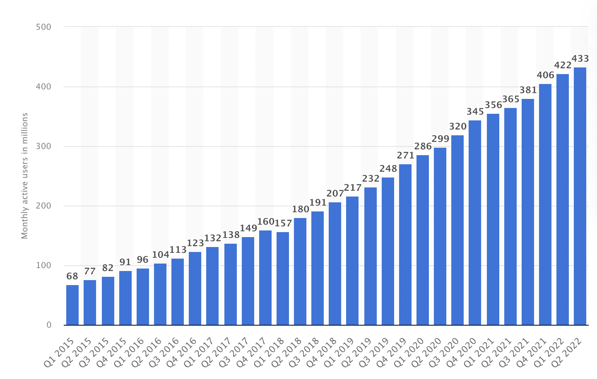
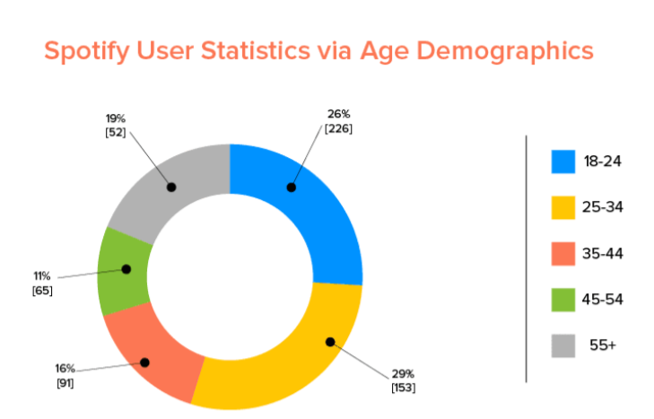

# HighLoad

## Тема работы

Spotify

## Основной функционал

- стриминг аудио
- хранение информации о музыкальных произведениях (текст, исполнители, альбомы)

## Целевая аудитория

Во втором квартале 2022 года сервис потоковой передачи музыки Spotify сообщил о 433 миллионах активных пользователей по всему миру. Это ознаменовало увеличение более чем на 60 миллионов всего за один год[1]:

Во втором квартале 2022 года количество ежемесячно активных пользователей Spotify по всему миру, поддерживаемых рекламой, достигло 256 миллионов по сравнению с 210 миллионами годом ранее.[2] 

По состоянию на второй квартал 2022 года у Spotify было 188 миллионов платных подписчиков по всему миру по сравнению со 165 миллионами в соответствующем квартале 2021 года.[3]

Ежедневно 44% пользователей слушают Spotify[4]

В целом Spotify наиболее популярен среди молодежи. Более половины пользователей Spotify моложе 35 лет[5]:

- 29% пользователей Spotify — миллениалы, а 26% из них моложе 24 лет. 
- Spotify также популярен среди пожилых людей: 19% пользователей старше 55 лет.
- Что касается пола, 56% пользователей Spotify — мужчины, а 44% — женщины.

Ежегодное количество пользователей Spotify по регионам с 2016 по 2021 год[6]:

 Год  | Европа  | Северная Америка  | Латинская Америка  | Остальной мир  |
------| --------| ------------------| -------------------| ---------------|
 2016 |  40 млн.|       36 млн.     |       20 млн.      |     8 млн.     |
 2017 |  51 млн.|       46 млн.     |       28 млн.      |     13 млн.    |
 2018 |  67 млн.|       56 млн.     |       38 млн.      |     20 млн.    |
 2019 |  84 млн.|       65 млн.     |       49 млн.      |     35 млн.    |
 2020 | 102 млн.|       78 млн.     |       66 млн.      |     54 млн.    |
 2021 | 121 млн.|       85 млн.     |       78 млн.      |     71 млн.    |

## Расчет нагрузки

* Месячная аудитория: 433 млн.
* Дневная аудитория: 44% от месячной аудитории - 190 млн.

### Хранение данных

Битрейт песни зависит от подписки и от качества соединения[7].
Для бесплатной версии высокое качество - 160 кбит/с, нормальное - 96 кбит/с, низкое - 24 кбит/с
Для платной версии высокое качество - 320 кбит/с, нормальное - 96 кбит/с, низкое - 24 кбит/с

Длительность одной композиции составляет в среднем 197 секунд[8].

Количество песен в Spotify - 80 млн.[9]

В расчетах не будем учитывать хранение текста песен и обложки

Размер 1 песни для каждого битрейта:
- 197 * 24 = 591 Кбайт = 0,58 Мбайт 
- 197 * 96 = 2,3 Мбайт 
- 197 * 160 = 3,8 Мбайт 
- 197 * 320 = 7,7 Мбайт

Размер хранилища для всей медиатеки:
80 * 10^6 * (0,58 + 2,3 + 3,8 + 7,7) = 1097 ТБ

### Сетевой трафик

Согласно последним доступным данным, среднее количество времени, которое активные пользователи платформы тратят на прослушивание Spotify, составляет 25 часов в месяц.[10]

То есть примерно 50 минут в день

188 млн. платных подписчиков из 433 млн. пользователей - 43%

DAU 190 млн. 

Дневной трафик:

`190 * 10^6 * 50 * 60 * (0,43 * 320 + 0,57 * 160)/8/1024/1024/1024 = 15182 Тб/сутки`

Трафик в секунду:

`15182 / 24 / 3600 * 8 = 1,4 Тбит/с`

В качестве источника пиковой нагрузки примем всех активных пользователей:

`433 * 10^6 * 50 * 60 * (0,43 * 320 + 0,57 * 160)/8/1024/1024/1024 = 34599 Тб/сутки`

В секунду:

`34599 / 24 / 3600 * 8 = 3,2 Тбит/с`

### RPS

#### Авторизация

Пусть запрос на авторизацию совершается раз в сутки

`190 * 10^6 / 24 / 60 / 60 = 2199 RPS`

#### Получение информации о своем плейлисте

Пусть человек заходит в свою медиатеку 2 раза в день

`190 * 10^6 * 2 / 24 / 60 / 60 = 4398 RPS`

#### Получение информации об конкретном альбоме, плейлисте

Пусть человек прослушивает 4 плейлиста в день:

`190 * 10^6 * 4 / 24 / 60 / 60 = 8796 RPS`

#### Загрузка трека

Загружается трек и информация о нем - 2 запроса

Средняя продолжительность одной песни - 197 секунд

Среднее время прослушивания песен в Spotify - 50 минут

`50 × 60 / 197 = 15` треков в среднем пользователь слушает в день

`190 * 10^6 * 2  * 15 / 24 / 60 / 60 = 65972 RPS`

#### Поиск

Пусть человек пользуется поиском 3 раза в день

`190 * 10^6 * 3 / 24 / 60 / 60 = 6597 RPS`

#### Итог

Всего RPS = 87962 RPS

| Авторизация | Cвой плейлист | Контент альбомов/плейлистов | Поиск     | Загрузка трека    |
|-------------|-----------|-----------------------------|-----------|-------------|
| 2199 RPS    | 4398 RPS | 8796 RPS                   | 6597 RPS | 65972 RPS |
| 2,5%        | 5,0%      | 10,0%                        | 7,5%      | 75%         |

## Источники
    1. https://www.statista.com/statistics/367739/spotify-global-mau/
    2. https://www.statista.com/statistics/813787/spotify-ad-supported-monthly-active-users/
    3. https://www.statista.com/statistics/244995/number-of-paying-spotify-subscribers/
    4. https://www.businessofapps.com/data/spotify-statistics/
    5. https://siteefy.com/spotify-statistics/
    6. https://www.businessofapps.com/data/spotify-statistics/
    7. https://support.spotify.com/us/article/audio-quality/
    8. https://www.statista.com/chart/26546/mean-song-duration-of-currently-streamable-songs-by-year-of-release/#:~:text=The%20average%20song%20released%20on,song%20lengths%20starting%20in%201990.
    9. https://newsroom.spotify.com/company-info/#:~:text=Discover%2C%20manage%20and%20share%20over,ad%2Dfree%20music%20listening%20experience.
    10. https://kommandotech.com/statistics/spotify-user-statistics/
 
